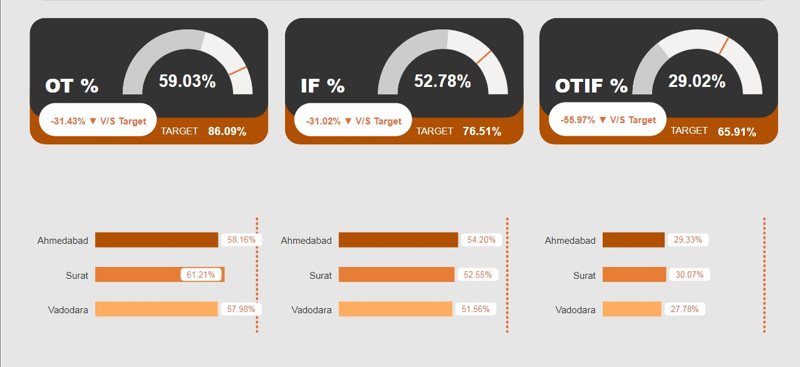
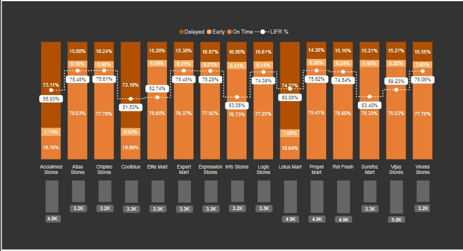
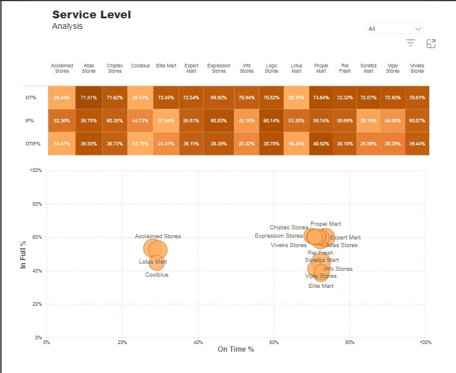
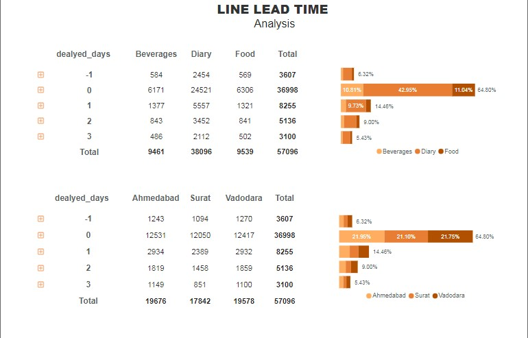
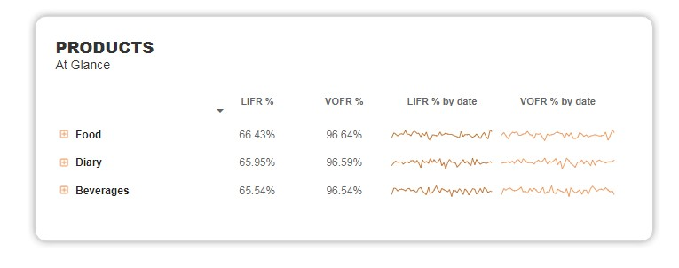

# Supply Chain Management Project
### Project Closing Date : 08-04-2024 (Monday)
## Invitation Acceptance & Others
  1. Accept Collaboration Invitation link from your mail
  2. Open GitHub Desktop
  3. Login your GitHub Account from GitHub Desktop
  4. Select Supply-Chain Repository
  5. Click Clone repository
  6. Set Repository Path
  7. Ok

## Push to remote repository
  1. Update your page in Power BI and Save
  2. Commit in GitHub Desktop
  3. <b>PUSH </b> to <b>DEVELOPMENT</b> branch
  4. Click Compare & Review
  5. Click <b> Create a PULL</b> Request
     
### :: Diponkar Roy > Page : Key Martics

### :: Farhana Haq > Page : Order-1

### :: Iffat Feroji > Page : Line Lead Time - 1

### :: Tanvir  > Page : Service Level

### :: Abu Yousuf  > Page : Line Lead Time & Products
##### Line Lead Time :

##### Products :
 
